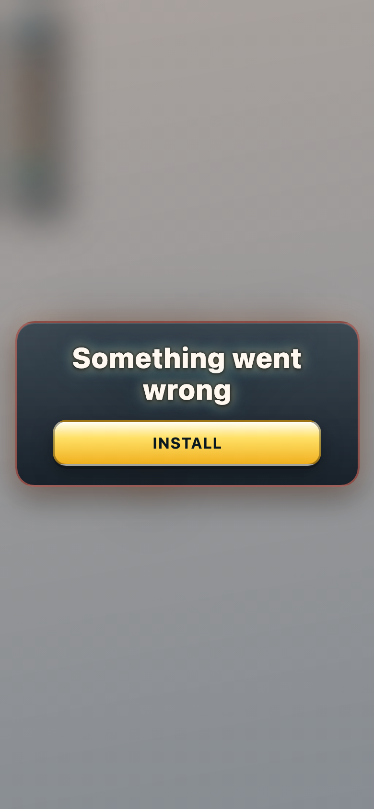
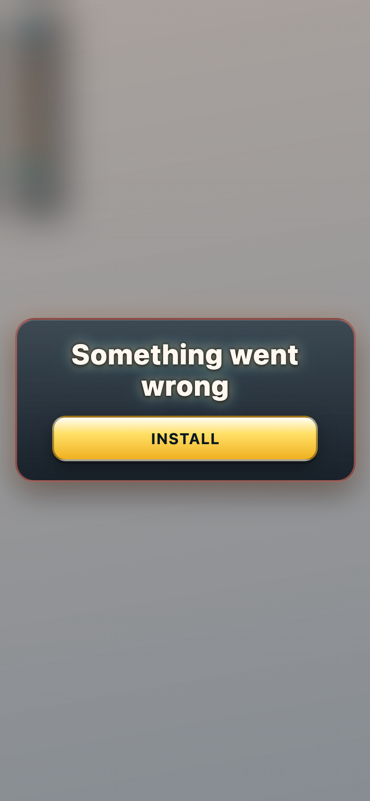

# fr_chic — theme-gen report

- **Display name**: FR + BE + QC — French chic
- **Audience**: French-speaking adults (FR, BE, QC), café culture, chic and elegant aesthetic
- **QA pass**: YES

## Palette
- sphereColors:
  - `#cf6d19`
  - `#e19335`
  - `#eebd53`
  - `#a6540a`
  - `#e2938b`
  - `#4c2b12`
  - `#adc386`
  - `#909178`
  - `#6b654b`
  - `#d5cbba`
- fieldDecorColors:
  - `#a7825e`
  - `#c6a279`
- backgroundColor: `#574435`

## Generation attempts
### trump — attempt 1 (ok)
Prompt:
```
(staged file: tools/theme-gen/agent-stage/fr_chic/trump.png)
```

### money — attempt 1 (ok)
Prompt:
```
(staged file: tools/theme-gen/agent-stage/fr_chic/money.png)
```

### poop — attempt 1 (ok)
Prompt:
```
(staged file: tools/theme-gen/agent-stage/fr_chic/poop.png)
```

### background — attempt 1 (ok)
Prompt:
```
(staged file: tools/theme-gen/agent-stage/fr_chic/bg.png)
```

## QA layers
### static: pass
- (no issues)

### render: pass
- (no issues)

## Screenshots


