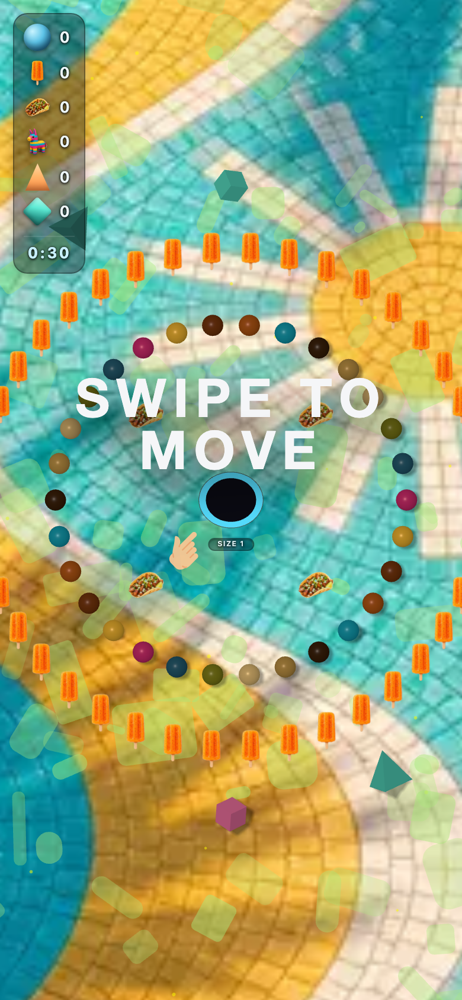
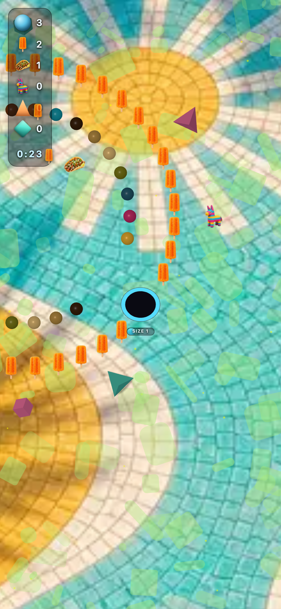

# global_fiesta — theme-gen report

- **Display name**: Global en + LATAM — vibrant fiesta
- **Audience**: English-speaking global audience plus LATAM, vibrant tropical and festive aesthetic
- **QA pass**: YES

## Palette
- sphereColors:
  - `#d23074`
  - `#f2b935`
  - `#7a3b10`
  - `#b45b18`
  - `#16a4bb`
  - `#3f250d`
  - `#c0974a`
  - `#eac57d`
  - `#84831c`
  - `#286076`
- fieldDecorColors:
  - `#1c949b`
  - `#e7b44f`
- backgroundColor: `#686f5b`

## Generation attempts
### trump — attempt 1 (ok)
Prompt:
```
(staged file: tools/theme-gen/agent-stage/global_fiesta/trump.png)
```

### money — attempt 1 (ok)
Prompt:
```
(staged file: tools/theme-gen/agent-stage/global_fiesta/money.png)
```

### poop — attempt 1 (ok)
Prompt:
```
(staged file: tools/theme-gen/agent-stage/global_fiesta/poop.png)
```

### background — attempt 1 (ok)
Prompt:
```
(staged file: tools/theme-gen/agent-stage/global_fiesta/bg.png)
```

## QA layers
### static: pass
- (no issues)

### render: pass
- (no issues)

## Screenshots


