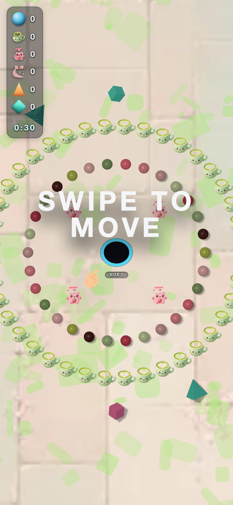
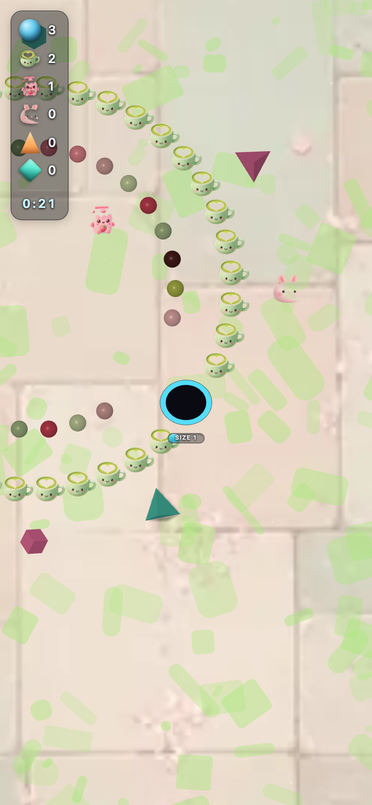

# jp_kawaii — theme-gen report

- **Display name**: JP female 18-34 — kawaii pastel
- **Audience**: Japanese women 18-34, kawaii / pastel aesthetic, soft and cute
- **QA pass**: YES

## Palette
- sphereColors:
  - `#bac555`
  - `#f2bbbd`
  - `#89a56d`
  - `#f07686`
  - `#f0929c`
  - `#ddaba9`
  - `#d0dead`
  - `#cc4659`
  - `#acc391`
  - `#502422`
- fieldDecorColors:
  - `#d8b6b1`
  - `#8c7e7a`
- backgroundColor: `#8a817a`

## Generation attempts
### trump — attempt 1 (ok)
Prompt:
```
(staged file: tools/theme-gen/agent-stage/jp_kawaii/trump.png)
```

### money — attempt 1 (ok)
Prompt:
```
(staged file: tools/theme-gen/agent-stage/jp_kawaii/money.png)
```

### poop — attempt 1 (ok)
Prompt:
```
(staged file: tools/theme-gen/agent-stage/jp_kawaii/poop.png)
```

### background — attempt 1 (ok)
Prompt:
```
(staged file: tools/theme-gen/agent-stage/jp_kawaii/bg.png)
```

## QA layers
### static: pass
- (no issues)

### render: pass
- (no issues)

## Screenshots


