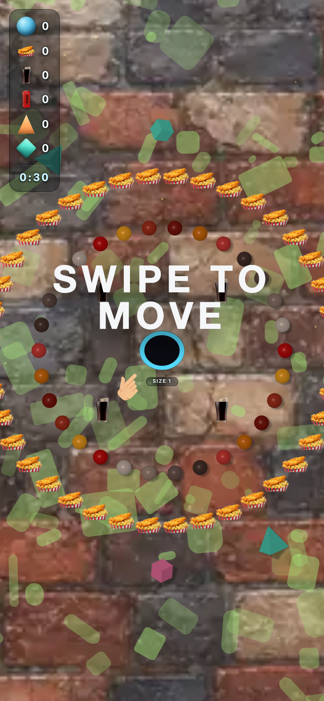

# uk_pub — theme-gen report

- **Display name**: UK + IE 18-30 — pub culture
- **Audience**: UK and Ireland Gen Z and Millennials (18-30), pub culture, quirky British aesthetic
- **QA pass**: YES

## Palette
- sphereColors:
  - `#c50d0f`
  - `#f3a523`
  - `#a93520`
  - `#831a11`
  - `#d6720f`
  - `#d03f3a`
  - `#4e3832`
  - `#745c57`
  - `#a38a7e`
  - `#ccbbb2`
- fieldDecorColors:
  - `#7f5749`
  - `#8f7b73`
- backgroundColor: `#3c3330`

## Generation attempts
### trump — attempt 1 (ok)
Prompt:
```
(staged file: tools/theme-gen/agent-stage/uk_pub/trump.png)
```

### money — attempt 1 (ok)
Prompt:
```
(staged file: tools/theme-gen/agent-stage/uk_pub/money.png)
```

### poop — attempt 1 (ok)
Prompt:
```
(staged file: tools/theme-gen/agent-stage/uk_pub/poop.png)
```

### background — attempt 1 (ok)
Prompt:
```
(staged file: tools/theme-gen/agent-stage/uk_pub/bg.png)
```

## QA layers
### static: pass
- (no issues)

### render: pass
- (no issues)

## Screenshots


