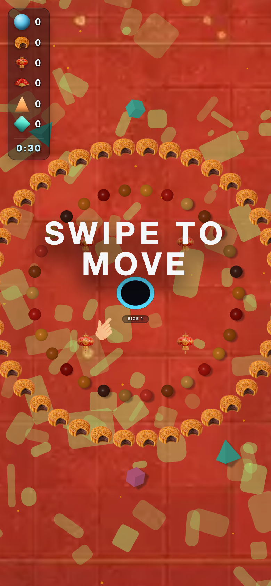
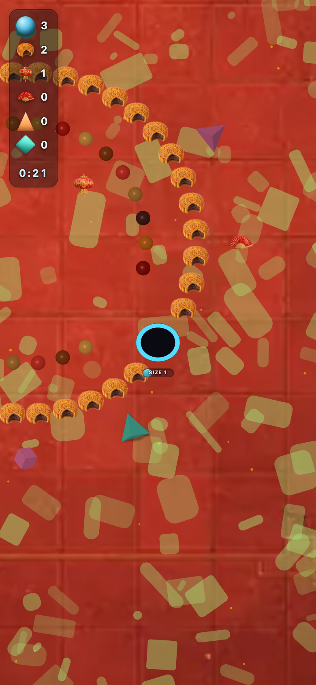

# zh_urban — theme-gen report

- **Display name**: zh-CN urban 18-35 — modern festive
- **Audience**: Chinese urban Gen Z and Millennials (18-35), modern festive aesthetic, premium-feel mobile content
- **QA pass**: YES

## Palette
- sphereColors:
  - `#d57016`
  - `#9e1007`
  - `#b95911`
  - `#eb8d24`
  - `#c91c12`
  - `#e8a049`
  - `#974011`
  - `#e43b2b`
  - `#c58136`
  - `#4e251b`
- fieldDecorColors:
  - `#762316`
  - `#922e1e`
- backgroundColor: `#491b12`

## Generation attempts
### trump — attempt 1 (ok)
Prompt:
```
(staged file: tools/theme-gen/agent-stage/zh_urban/trump.png)
```

### money — attempt 1 (ok)
Prompt:
```
(staged file: tools/theme-gen/agent-stage/zh_urban/money.png)
```

### poop — attempt 1 (ok)
Prompt:
```
(staged file: tools/theme-gen/agent-stage/zh_urban/poop.png)
```

### background — attempt 1 (ok)
Prompt:
```
(staged file: tools/theme-gen/agent-stage/zh_urban/bg.png)
```

## QA layers
### static: pass
- (no issues)

### render: pass
- (no issues)

## Screenshots


