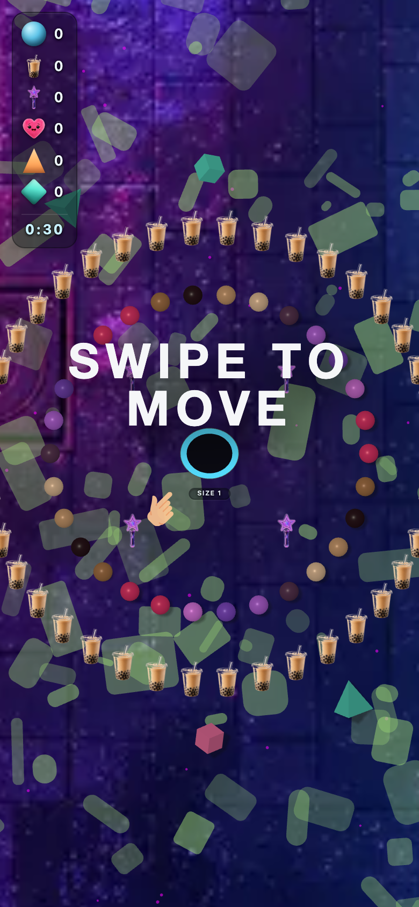
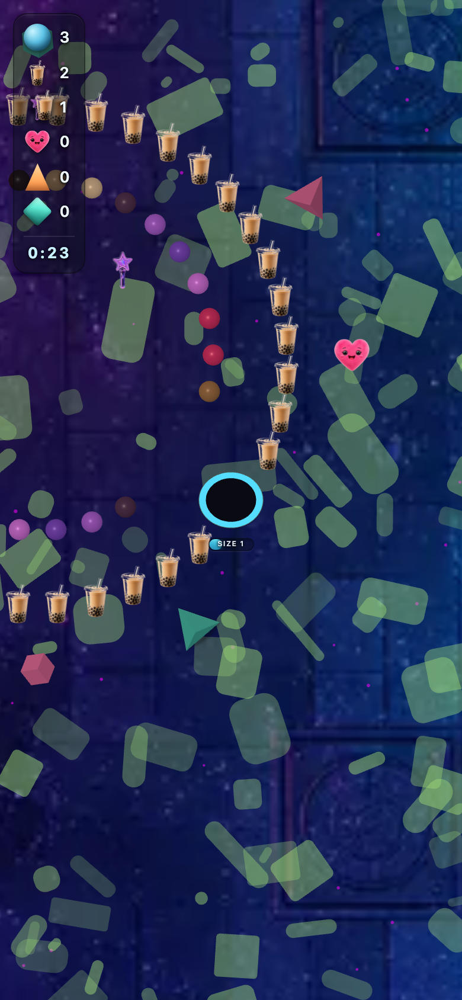

# kr_sea_pop — theme-gen report

- **Display name**: KR + SEA 16-30 — K-pop / boba
- **Audience**: Korean and Southeast Asian Gen Z (16-30), K-pop fans, boba culture, vibrant nightlife
- **QA pass**: YES

## Palette
- sphereColors:
  - `#e73970`
  - `#aa784d`
  - `#2e181f`
  - `#d0a277`
  - `#eac7a3`
  - `#5d3a58`
  - `#bb6ae7`
  - `#8750d2`
  - `#e680f3`
  - `#e73970`
- fieldDecorColors:
  - `#1485c8`
  - `#103a8b`
- backgroundColor: `#26164a`

## Generation attempts
### trump — attempt 1 (ok)
Prompt:
```
(staged file: tools/theme-gen/agent-stage/kr_sea_pop/trump.png)
```

### money — attempt 1 (ok)
Prompt:
```
(staged file: tools/theme-gen/agent-stage/kr_sea_pop/money.png)
```

### poop — attempt 1 (ok)
Prompt:
```
(staged file: tools/theme-gen/agent-stage/kr_sea_pop/poop.png)
```

### background — attempt 1 (ok)
Prompt:
```
(staged file: tools/theme-gen/agent-stage/kr_sea_pop/bg.png)
```

## QA layers
### static: pass
- (no issues)

### render: pass
- (no issues)

## Screenshots


