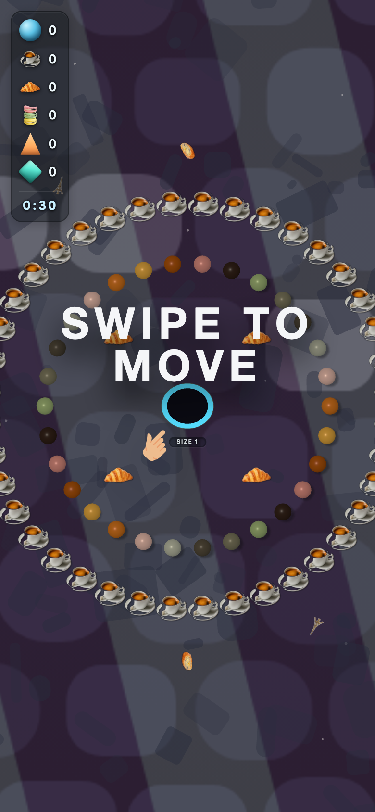
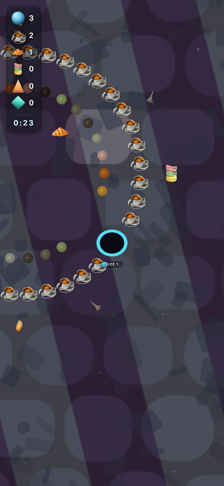
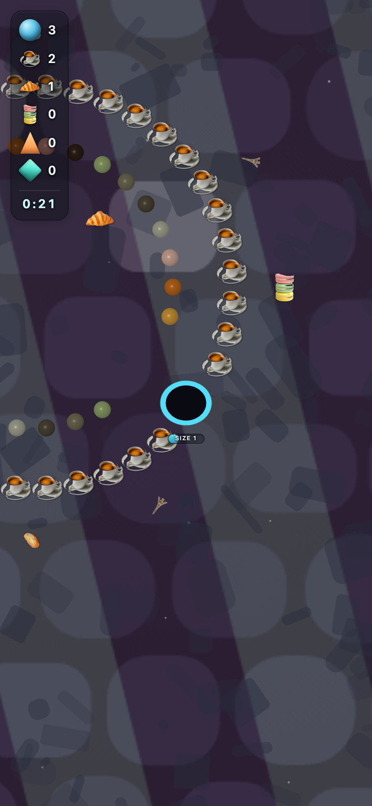

# fr_chic — theme-gen report

- **Display name**: FR + BE + QC — French chic
- **Audience**: French-speaking adults (FR, BE, QC), café culture, chic and elegant aesthetic
- **QA pass**: YES

## Palette
- sphereColors:
  - `#d67922`
  - `#e8ae45`
  - `#ae570d`
  - `#db9085`
  - `#37261d`
  - `#a1b87c`
  - `#7f7c64`
  - `#595142`
  - `#bdc1ae`
  - `#ebc2b5`
- fieldDecorColors:
  - `#ffffff`
  - `#ffffff`
- backgroundColor: `#121624`

## Generation attempts
### trump — attempt 1 (ok)
Prompt:
```
(staged file: tools/theme-gen/agent-stage/fr_chic/trump.png)
```

### money — attempt 1 (ok)
Prompt:
```
(staged file: tools/theme-gen/agent-stage/fr_chic/money.png)
```

### poop — attempt 1 (ok)
Prompt:
```
(staged file: tools/theme-gen/agent-stage/fr_chic/poop.png)
```

### decor_cube — attempt 1 (ok)
Prompt:
```
(staged file: tools/theme-gen/agent-stage/fr_chic/decor_cube.png)
```

### decor_triangle — attempt 1 (ok)
Prompt:
```
(staged file: tools/theme-gen/agent-stage/fr_chic/decor_triangle.png)
```

### background — attempt 1 (ok)
Prompt:
```
(svg generator: cafe_cobble)
```

## QA layers
### static: pass
- (no issues)

### contrast: pass
- (no issues)

### render: pass
- (no issues)

## Screenshots


