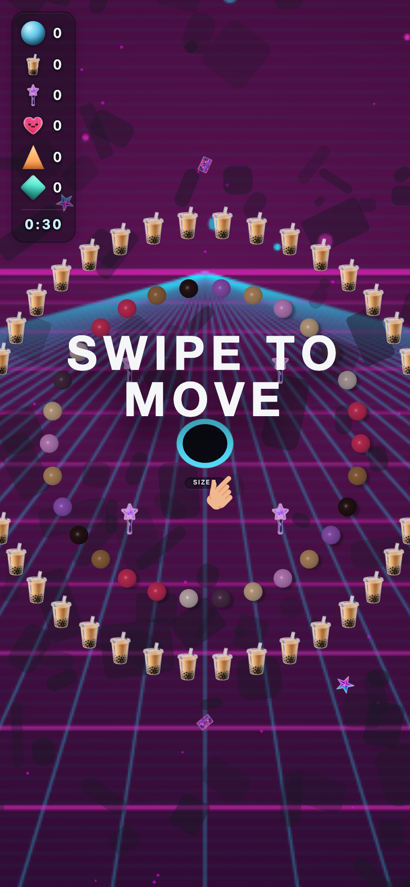
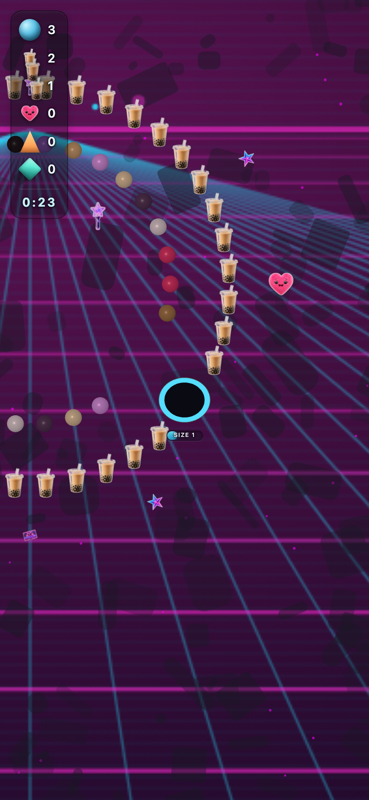
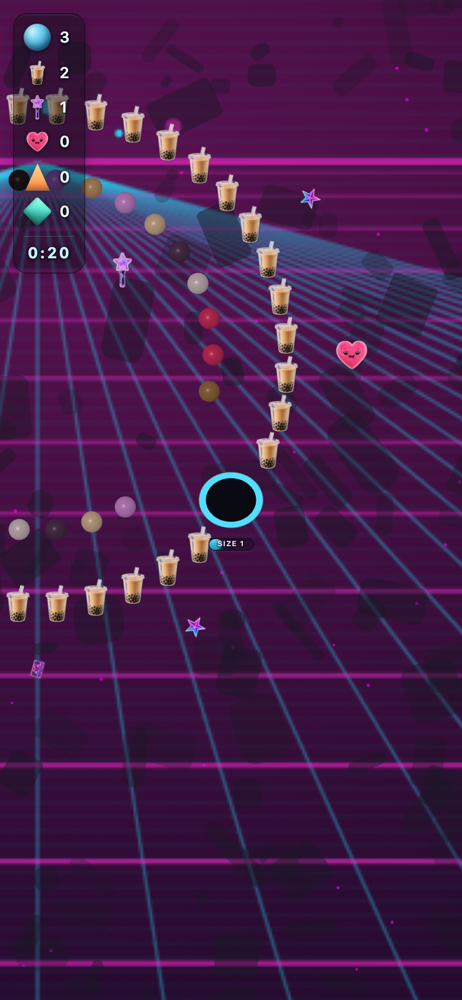

# kr_sea_pop — theme-gen report

- **Display name**: KR + SEA 16-30 — K-pop / boba
- **Audience**: Korean and Southeast Asian Gen Z (16-30), K-pop fans, boba culture, vibrant nightlife
- **QA pass**: YES

## Palette
- sphereColors:
  - `#e2376c`
  - `#a8784e`
  - `#2f191e`
  - `#a662dc`
  - `#d0a277`
  - `#de97ea`
  - `#e4c5a6`
  - `#5a395c`
  - `#e5d2db`
  - `#e2376c`
- fieldDecorColors:
  - `#ffffff`
  - `#ffffff`
- backgroundColor: `#05040e`

## Generation attempts
### background — attempt 1 (ok)
Prompt:
```
(svg generator: neon_grid)
```

### trump — attempt 1 (ok)
Prompt:
```
(staged file: tools/theme-gen/agent-stage/kr_sea_pop/trump.png)
```

### money — attempt 1 (ok)
Prompt:
```
(staged file: tools/theme-gen/agent-stage/kr_sea_pop/money.png)
```

### poop — attempt 1 (ok)
Prompt:
```
(staged file: tools/theme-gen/agent-stage/kr_sea_pop/poop.png)
```

### decor_cube — attempt 1 (ok)
Prompt:
```
(staged file: tools/theme-gen/agent-stage/kr_sea_pop/decor_cube.png)
```

### decor_triangle — attempt 1 (ok)
Prompt:
```
(staged file: tools/theme-gen/agent-stage/kr_sea_pop/decor_triangle.png)
```

## QA layers
### static: pass
- (no issues)

### contrast: pass
- (no issues)

### render: pass
- (no issues)

## Screenshots


