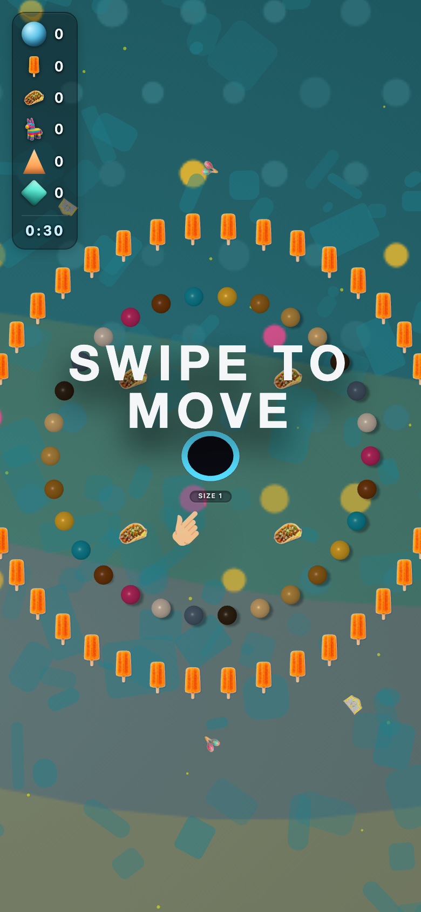
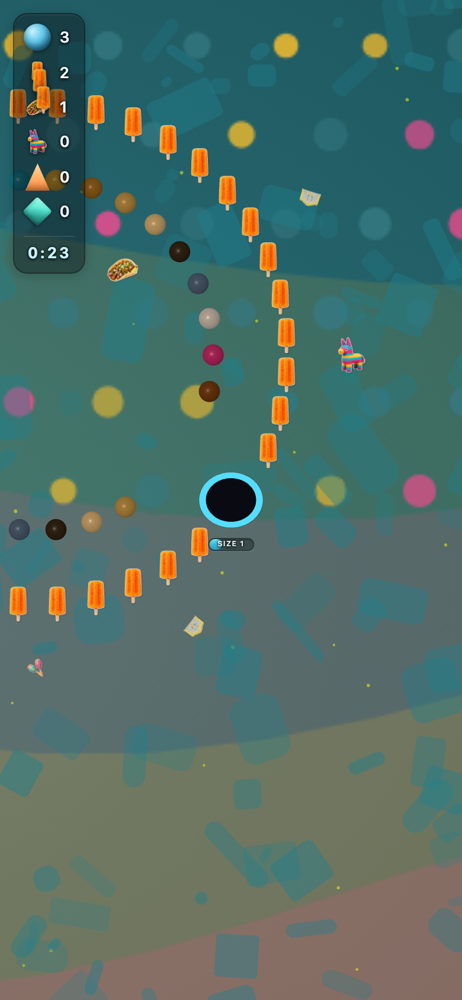

# global_fiesta — theme-gen report

- **Display name**: Global en + LATAM — vibrant fiesta
- **Audience**: English-speaking global audience plus LATAM, vibrant tropical and festive aesthetic
- **QA pass**: YES

## Palette
- sphereColors:
  - `#d53174`
  - `#82440f`
  - `#159cb4`
  - `#f4bb2e`
  - `#a97220`
  - `#cfa04d`
  - `#eac180`
  - `#3c2c1a`
  - `#586d84`
  - `#e5d5c8`
- fieldDecorColors:
  - `#9f705a`
  - `#4e6b68`
- backgroundColor: `#0a5b66`

## Generation attempts
### background — attempt 1 (ok)
Prompt:
```
(svg generator: beach_mosaic)
```

### trump — attempt 1 (ok)
Prompt:
```
(staged file: tools/theme-gen/agent-stage/global_fiesta/trump.png)
```

### money — attempt 1 (ok)
Prompt:
```
(staged file: tools/theme-gen/agent-stage/global_fiesta/money.png)
```

### poop — attempt 1 (ok)
Prompt:
```
(staged file: tools/theme-gen/agent-stage/global_fiesta/poop.png)
```

### decor_cube — attempt 1 (ok)
Prompt:
```
(staged file: tools/theme-gen/agent-stage/global_fiesta/decor_cube.png)
```

### decor_triangle — attempt 1 (ok)
Prompt:
```
(staged file: tools/theme-gen/agent-stage/global_fiesta/decor_triangle.png)
```

## QA layers
### static: pass
- (no issues)

### contrast: pass
- (no issues)

### render: pass
- (no issues)

## Screenshots


