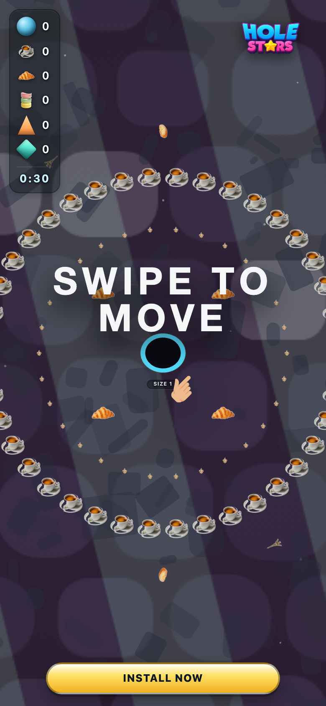
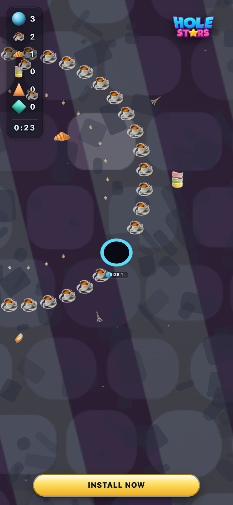
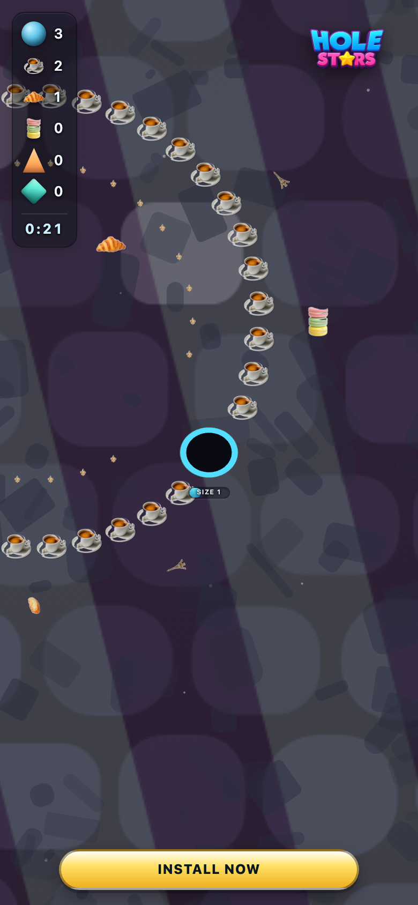

# fr_chic — theme-gen report

- **Display name**: FR + BE + QC — French chic
- **Audience**: French-speaking adults (FR, BE, QC), café culture, chic and elegant aesthetic
- **QA pass**: YES

## Palette
- sphereColors:
  - `#cb6916`
  - `#eab84c`
  - `#dd8934`
  - `#9f530b`
  - `#e2988e`
  - `#4f3119`
  - `#a9b290`
  - `#929377`
  - `#716c51`
  - `#c4c8b2`
- fieldDecorColors:
  - `#ffffff`
  - `#ffffff`
- backgroundColor: `#121624`

## Generation attempts
### background — attempt 1 (ok)
Prompt:
```
(svg generator: cafe_cobble)
```

### sphere — attempt 1 (ok)
Prompt:
```
(staged file: tools/theme-gen/agent-stage/fr_chic/sphere.png)
```

### trump — attempt 1 (ok)
Prompt:
```
(staged file: tools/theme-gen/agent-stage/fr_chic/trump.png)
```

### money — attempt 1 (ok)
Prompt:
```
(staged file: tools/theme-gen/agent-stage/fr_chic/money.png)
```

### poop — attempt 1 (ok)
Prompt:
```
(staged file: tools/theme-gen/agent-stage/fr_chic/poop.png)
```

### decor_cube — attempt 1 (ok)
Prompt:
```
(staged file: tools/theme-gen/agent-stage/fr_chic/decor_cube.png)
```

### decor_triangle — attempt 1 (ok)
Prompt:
```
(staged file: tools/theme-gen/agent-stage/fr_chic/decor_triangle.png)
```

## QA layers
### static: pass
- (no issues)

### contrast: pass
- (no issues)

### render: pass
- (no issues)

## Screenshots


