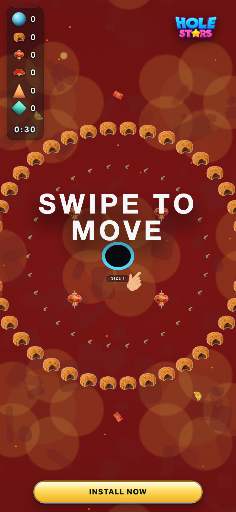
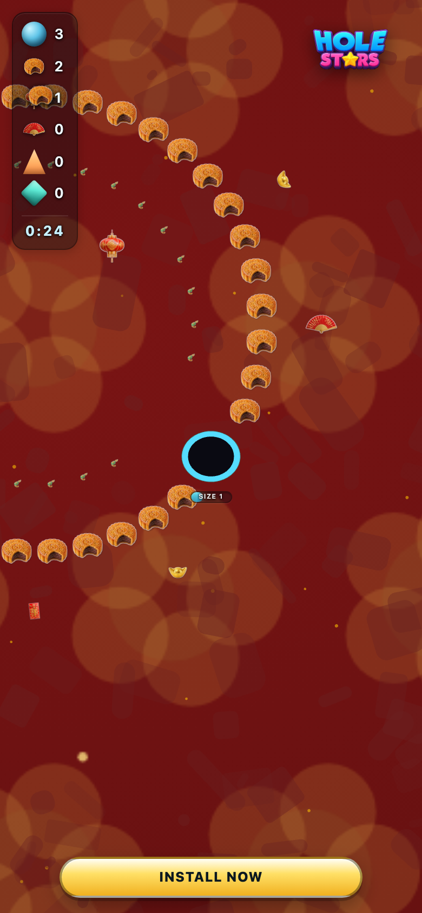

# zh_urban — theme-gen report

- **Display name**: zh-CN urban 18-35 — modern festive
- **Audience**: Chinese urban Gen Z and Millennials (18-35), modern festive aesthetic, premium-feel mobile content
- **QA pass**: YES

## Palette
- sphereColors:
  - `#c96715`
  - `#e68924`
  - `#a24712`
  - `#9a1207`
  - `#e59f4f`
  - `#de3425`
  - `#bf150d`
  - `#c3823c`
  - `#e96149`
  - `#51271c`
- fieldDecorColors:
  - `#6a1211`
  - `#722618`
- backgroundColor: `#490c0c`

## Generation attempts
### background — attempt 1 (ok)
Prompt:
```
(svg generator: paper_festive)
```

### sphere — attempt 1 (ok)
Prompt:
```
(staged file: tools/theme-gen/agent-stage/zh_urban/sphere.png)
```

### trump — attempt 1 (ok)
Prompt:
```
(staged file: tools/theme-gen/agent-stage/zh_urban/trump.png)
```

### money — attempt 1 (ok)
Prompt:
```
(staged file: tools/theme-gen/agent-stage/zh_urban/money.png)
```

### poop — attempt 1 (ok)
Prompt:
```
(staged file: tools/theme-gen/agent-stage/zh_urban/poop.png)
```

### decor_cube — attempt 1 (ok)
Prompt:
```
(staged file: tools/theme-gen/agent-stage/zh_urban/decor_cube.png)
```

### decor_triangle — attempt 1 (ok)
Prompt:
```
(staged file: tools/theme-gen/agent-stage/zh_urban/decor_triangle.png)
```

## QA layers
### static: pass
- (no issues)

### contrast: pass
- (no issues)

### render: pass
- (no issues)

## Screenshots


