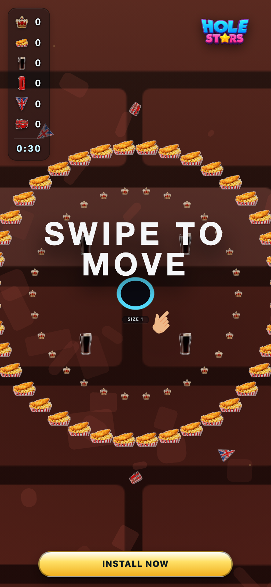
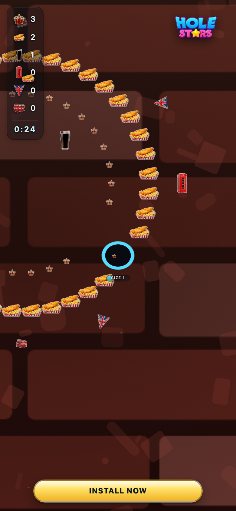
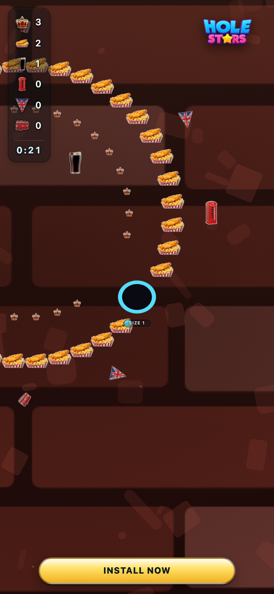

# uk_pub — theme-gen report

- **Display name**: UK + IE 18-30 — pub culture
- **Audience**: UK and Ireland Gen Z and Millennials (18-30), pub culture, quirky British aesthetic
- **QA pass**: YES

## Palette
- sphereColors:
  - `#c91213`
  - `#971f15`
  - `#f1a223`
  - `#c0443f`
  - `#ce6a0d`
  - `#4b211b`
  - `#5f4c47`
  - `#bf988d`
  - `#ddcec5`
  - `#887470`
- fieldDecorColors:
  - `#723f37`
  - `#a9926f`
- backgroundColor: `#7a2f24`

## Generation attempts
### background — attempt 1 (ok)
Prompt:
```
(svg generator: brick_warm)
```

### sphere — attempt 1 (ok)
Prompt:
```
(staged file: tools/theme-gen/agent-stage/uk_pub/sphere.png)
```

### trump — attempt 1 (ok)
Prompt:
```
(staged file: tools/theme-gen/agent-stage/uk_pub/trump.png)
```

### money — attempt 1 (ok)
Prompt:
```
(staged file: tools/theme-gen/agent-stage/uk_pub/money.png)
```

### poop — attempt 1 (ok)
Prompt:
```
(staged file: tools/theme-gen/agent-stage/uk_pub/poop.png)
```

### decor_cube — attempt 1 (ok)
Prompt:
```
(staged file: tools/theme-gen/agent-stage/uk_pub/decor_cube.png)
```

### decor_triangle — attempt 1 (ok)
Prompt:
```
(staged file: tools/theme-gen/agent-stage/uk_pub/decor_triangle.png)
```

### poop — attempt 102 (ok)
Prompt:
```
(contrast retry, options={"outlineRadius":4,"outlineAlpha":0.8400000000000001,"shadowOffset":5,"shadowBlur":5,"shadowAlpha":0.34,"bgLuminance":0.15738002648446536})
```
Issues:
- Low contrast for poop (icon L=0.31 vs bg L=0.16 → weighted Δ=0.17 < 0.18)

### decor_cube — attempt 102 (ok)
Prompt:
```
(contrast retry, options={"outlineRadius":4,"outlineAlpha":0.8400000000000001,"shadowOffset":5,"shadowBlur":5,"shadowAlpha":0.34,"bgLuminance":0.15738002648446536})
```
Issues:
- Low contrast for decor_cube (icon L=0.33 vs bg L=0.16 → weighted Δ=0.18 < 0.18)

## QA layers
### static: pass
- (no issues)

### contrast: pass
- (no issues)

### render: pass
- (no issues)

## Screenshots


