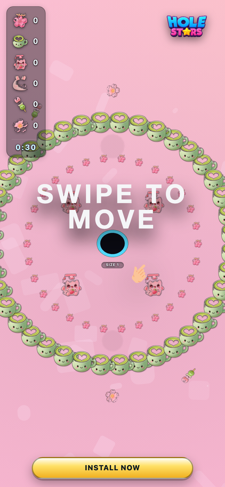
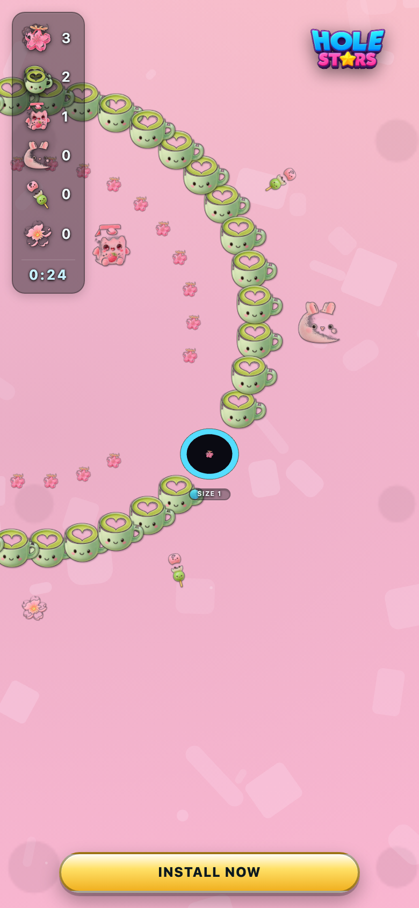
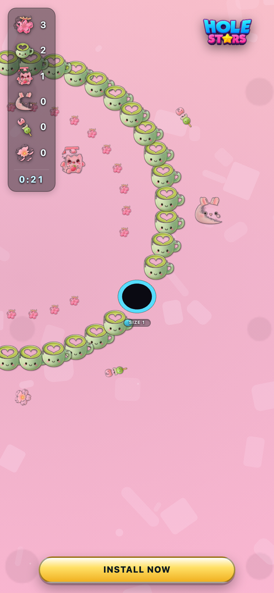

# jp_kawaii — theme-gen report

- **Display name**: JP female 18-34 — kawaii pastel
- **Audience**: Japanese women 18-34, kawaii / pastel aesthetic, soft and cute
- **QA pass**: YES

## Palette
- sphereColors:
  - `#edafb3`
  - `#b9c455`
  - `#ee8995`
  - `#8ba671`
  - `#d6a4a6`
  - `#37282a`
  - `#aec292`
  - `#e5697a`
  - `#a88287`
  - `#cfddad`
- fieldDecorColors:
  - `#e2a3bc`
  - `#edacc5`
- backgroundColor: `#ffb8d4`

## Generation attempts
### background — attempt 1 (ok)
Prompt:
```
(svg generator: kawaii_dots)
```

### sphere — attempt 1 (ok)
Prompt:
```
(staged file: tools/theme-gen/agent-stage/jp_kawaii/sphere.png)
```

### trump — attempt 1 (ok)
Prompt:
```
(staged file: tools/theme-gen/agent-stage/jp_kawaii/trump.png)
```

### money — attempt 1 (ok)
Prompt:
```
(staged file: tools/theme-gen/agent-stage/jp_kawaii/money.png)
```

### poop — attempt 1 (ok)
Prompt:
```
(staged file: tools/theme-gen/agent-stage/jp_kawaii/poop.png)
```

### decor_cube — attempt 1 (ok)
Prompt:
```
(staged file: tools/theme-gen/agent-stage/jp_kawaii/decor_cube.png)
```

### decor_triangle — attempt 1 (ok)
Prompt:
```
(staged file: tools/theme-gen/agent-stage/jp_kawaii/decor_triangle.png)
```

## QA layers
### static: pass
- (no issues)

### contrast: pass
- (no issues)

### render: pass
- (no issues)

## Screenshots


